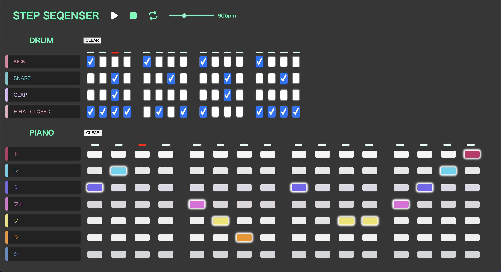

# ステップシーケンサー

## 概要

グリッド状のインターフェイスを持ち、ステップ毎の発音するかしないかを選ぶことによって、ドラムとメロディーのパターンを作れるアプリ。
 

## アプリ URL

- https://beji-django-stepsequencer.herokuapp.com/

## 作成背景

ブラウザ上で気軽に音楽制作できるようなものがあれば良いと思ったため。また普段音楽制作ソフトで使っている機能を実装することによって、その処理を理解するため。

## 使用技術

- フロントエンド

  - HTML
  - CSS
  - JavaScript
  - tonejs(js ライブラリ)

- バックエンド
  - Django
  - heroku

## 今後実装予定

- ピアノシーケンサーにおいて、音を連続して置いた際に発音のタイミングがずれるバクを修正
- drum のチェックボックスの UI を変更
- キーとスケールを選択できるようにする
- コード機能の実装
- それぞれの音と、全体の音量を調整できるように
- 音色の変更(実際の音声ファイルを使えるようにする。現在のシンセのパラメータをユーザーがいじれるようにする)
- エフェクト(reverb, delay, destortion, etc)の実装
- いくつかのジャンルのテンプレートやデモを用意
- 作ったパターンの保存
